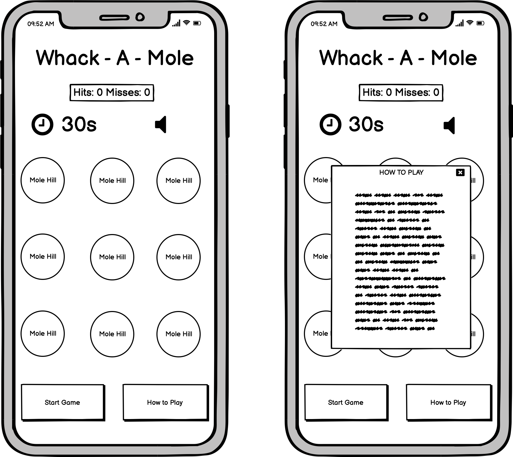
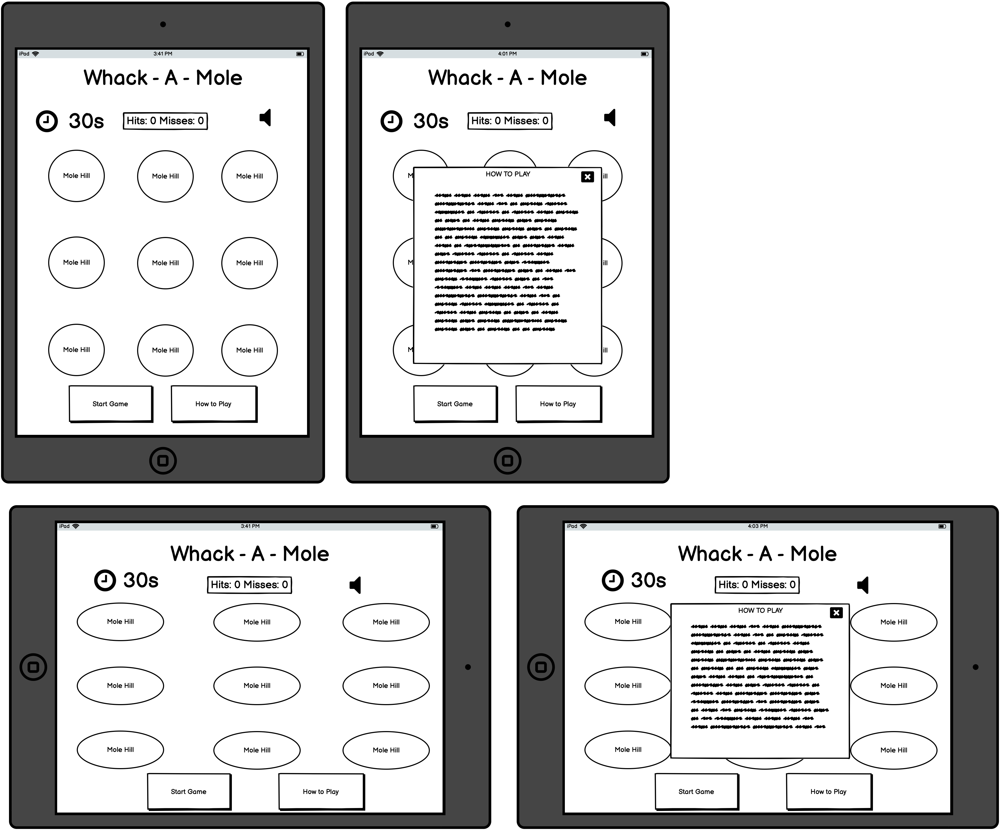
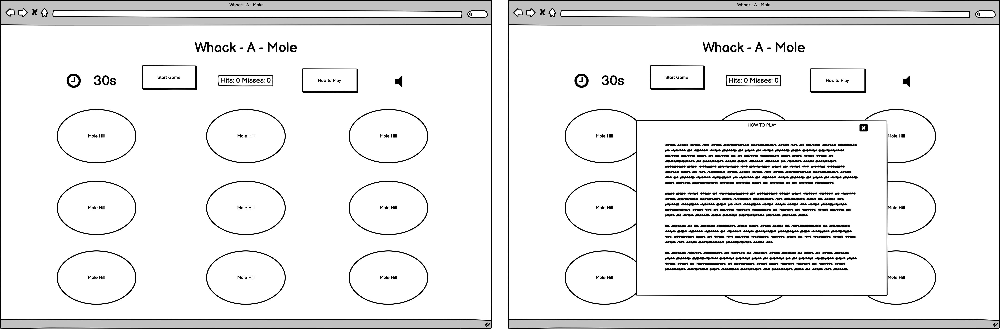
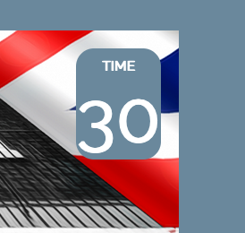
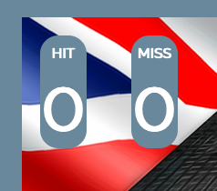
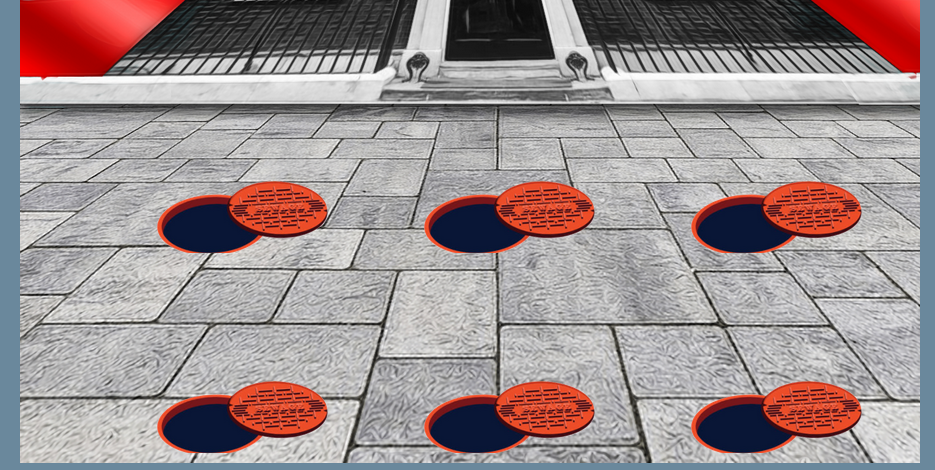
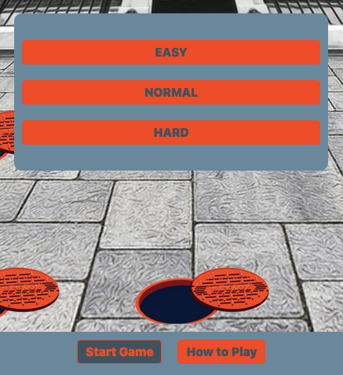
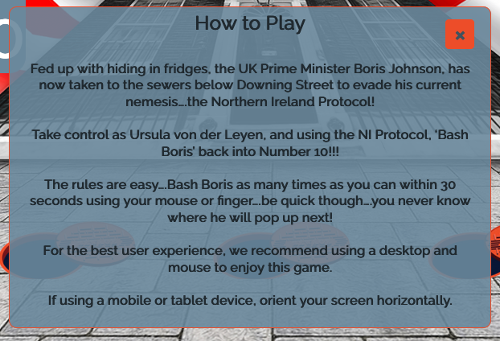
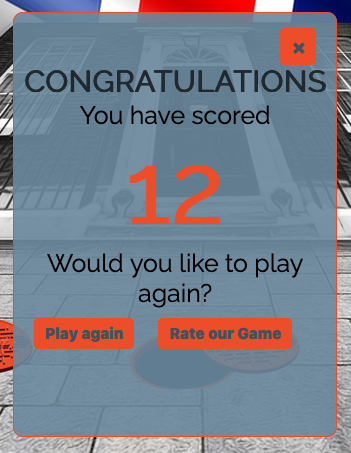
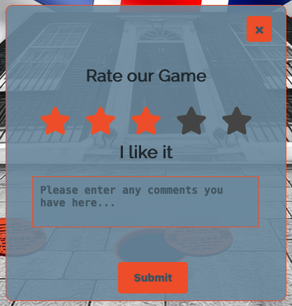

# Bash Boris

Bash Boris is a fun satirical browser game based on the popular fairground and arcade game, Whack-A-Mole, which was first introduced in 1975. This javascript version is optimised for use on desktop, but can also be used via a mobile or tablet device.

## Table of Contents

## Site Design Considerations

### Site Goals

1. To provide a fun game to play that requires little instruction.
2. To provide a game that is responsive across all devices.
3. To provide a game that entices the user to return to play again.
4. To provide differing game modes dependant on user preference.
5. To record scores of each game to enable user to return to beat score
6. To ensure the game is fully accessible to those users that may require assisstive technologies.

### User Stories and Goals

* As a user, I want to easily ascertain the purpose of the website.
* As user, I want to be able to view the website on any of my devices without any loss of functionality.
* As a user, I want to be able to easily understand the game instructions.
* As a user, I want to be able to see my score easily.
* As a user, I want to be able to keep track of my time remaining easily.
* As a user, I want to be able to play different game modes.
* As a user, I want to be able to record my scores.
* As a user, I want to be able to toggle the volume on and off.

### Site Design Approach

The brief for this project was to create an interactive front-end site that should respond to a user’s actions. To this end, it was decided to create a Whack A Mole style game. Early on in the design process it was decided to create a themed game.

Simple javascript games are ubiquitous online, and if thinking commercially, to drive traffic and advertising revenue to a site above others offering a similar experience, a developer needs to appreciate the zeitgeist at the time, and offer something current and in the public’s mind.

There can be no bigger current affair in the UK at the moment than Brexit, and framing a game around a ‘popular’ subject can tap into general discourse at the time. 

It was for this reason that a theme involving the UK Prime Minister and the Northern Ireland Protocol was chosen. It is current, with high public visibility, and if presenting commercially taps into public conversation at the time....and also...who wouldn't love to give their own politicians a virtual bashing!!

### Game Visual Design and Font

In keeping with the game theme, it was decided that the main backdrop for the game should be a image of 10 Downing Street. This served two purposes, firstly as discussed it ties in with the theme that the game is carrying, and second, the path area of Downing Street would be perfect to contain mole holes.

Again instead of using standard holes, as the main game area was to be a street, it was decided to use man hole covers to maintain the game theme.

The colours used reflect the colours used in the background, namely blues, reds and whites. This was specifcially chosen to mirror the colours of the UK national flag, again to keep the theme consistent throughout. Fredoka and Raleway were intially chosen as site fonts, with Raleway being the predominant font used. These fonts are modern, legible and make it easy for the user to understand any text areas in the site. 

For the moles, again on theme, a picture of the Prime Ministers head was used. To ensure the game remained fun and light hearted, and so as to not be accused of bullying or bad taste, the decision was taken to cartoonise all of the image elements. 

In doing this, it enforces that the game is meant to be fun, humorous and satirical, and is in no way intended to demonise the main character (the PM).

Finally, it was chosen to force the user to play the game horizontally. It was initially intended to be played on either device rotation, but on testing it was found that forcing users to play horizontally would ensure that mobile users can use the same background as desktop users, so again to maintain the theme that the game is trying to portray. 

## Wireframes

### Mobile version

### Tablet version

### Desktop version

## Features

### Initial Deployment Features

Header

* The site header contains the game title and the mute volume button. No navigation menu is required as the site is wholly contained one on HTML page.

Timer

* The game timer keeps track of game time progress

Counters

* The hit and miss counters keep track of score throughout the game

Game Board

* The main game board contains the six possible options for a mole to pop out from. the board also serves as the backdrop for the site pop ups.

Game Buttons

* The game buttons allow the user to either start the game (which opens the difficulty setting pop up first) or the game rules.

Rules Pop Up

* The game rules provide some background to the game, and also how to play it. It also enforces the point that the game is optimised for desktop or for horizontal viewing.

Final Score Pop Up

* The final score pop out provides the user with the score they got during the game. It also provides a button option to play again, and also has a button should a user wish to rate the game.

Feedback Pop Up

* The feedback pop up only appears once the user has played a game, so that someone cannot leave a review without first playing at least once. The feedback has an option for a star rating, and some text feedback. As we will not need to contact any user, any personal user details are not requested.

Footer

The footer conatins links to social media channels and the developer copyright message.

### Future Features

1. It would be advantageous to provide a high score capture mechanism. At the time of creation, a local storage method could have been used, but this would only store scores on an indiviual device, and would not function like a 'normal' high scores database would, taking in scores from various different users.

2. I would like to animate the cursor in future deployments so that on each mouse click, the paper would move simulating a strike, much like swatting a fly. Early attempts to include this proved unsuccessful but it is definitely a feature that should be added in future.

3. I would consider adding an 'infintity' play mode in addition to the three game modes already provided. This mode would run continuously, with the game picking up speed after a predetemined amount of time, perhaps every 30 seconds. The game would then end when the user missed a selected number of mole pop ups.

4. I would like to add a number of different images for the mole character, depending on whether or not the mole had been struck or not. Samples of what these images might look like are provided in the images folder but have not been used. This would add another level of complexity and professionalism to the game.

5. If publishing on a commercial basis, space has been left either side of the game board. It is envisaged that this space is where advertisements would be placed, in the users view but not distracting from the main game board either.

## Technologies Used

* [HTML5](https://en.wikipedia.org/wiki/HTML5) was used for the site markup
* [CSS3](https://en.wikipedia.org/wiki/CSS#CSS_3) was used to style the HTML content
* [Javascript](https://en.wikipedia.org/wiki/JavaScript) was used for the game functions and the manipultation of the game pop ups.
* [Balsamiq](https://balsamiq.com/) was used to produce the site wireframes
* [Adobe Photoshop](https://www.adobe.com/uk/products/photoshop.html) was used to resize site images
* [befunky](https://www.befunky.com/) was used to cartoonize all sites images.
* [Font Awesome](https://fontawesome.com/) was used for the site icons
* [Google Fonts](https://fonts.google.com/) provided all of the fonts used on the site
* [Firefox Developer tool](https://developer.mozilla.org/en-US/docs/Tools) was used to test site responsiveness and to test code
* [Google Chrome Developer tools](https://developer.chrome.com/docs/devtools/) was used to test site responsiveness and to test code
* [Safari Developer tools](https://support.apple.com/en-gb/guide/safari/sfri20948/mac) was used to test site responsiveness and to test code
* [JSFiddle](https://jsfiddle.net/) was used to test code throughout the project
* [Github](https://github.com/Chris-McGonigle) was used as the repository hosting service
* [Gitpod](https://www.gitpod.io/) was used as the Code Editor for the site
* [Favicon.cc](https://www.favicon.cc/) was used to create the site favicon
* [W3C Markup](https://validator.w3.org/) and [Jigsaw validation](https://jigsaw.w3.org/) tools were used to validate the HTML and CSS used.
* [JSHint](https://jshint.com/) was used to validate the javascript used on site. 

## Testing

All technical testing carried out during the lifetime of this project can be found by following this link to the dedicated [testing documentation](./testing/TESTING.md)

### Site Goals and User Expectation Testing

#### Site Goals testing

1. To provide a fun game to play that requires little instruction.
    * Result: TEST PASSED
        * Due to the nature of the game it is based on, it is plain from the site load that this is a whack a mole style game. The instructions given are succinct and easy to understand.    
2. To provide a game that is responsive across all devices.
    * Result : TEST PART PASSED
        * The game works well on all mobile screens with the exception of the iPhone 5, due to the nature of its very small screen in comparison to todays modals. As this is a near obsolete device it was decided to carry on wit the larger devices. It is however best played on a desktop to have maximum enjoyment from the game.
3. To provide a game that entices the user to return to play again.
    * Result: TEST PASSED
        * The sound effects help add an element of fun to the game, along with the overall theme. I would submit that any game that allows users to vent their frustrations about people in power will keep users coming back for more...a destress if you will!!
4. To provide differing game modes dependant on user preference.
    * Result: TEST PASSED
        * An easy, normal and hard level ahve been programmed so a user can select one of their choosing.
5. To record scores of each game to enable user to return to beat score.
    * Result: TEST PART PASSED
        * A score is provided to the user throughout the game, and is again displayed on game end. There is however no way as yet to store these scores so that a user can compare against them on their return. the addition of this would help drive a further element of competition to the game.
6. To ensure the game is fully accessible to those users that may require assisstive technologies.
    * Result: TEST PART PASSED
        * All possible accessibility measures have been taken, including the use of labels and alt text where required. Due to the bature of the game, it would be difficult to program this for those people with visual impairment. one possibility would be for a voice to say the name of the chosen hole as it was selected, and the user could then use the keyboard to select the required hole. This is a feature that may be implemented in future.

### User Stories Testing

* As a user, I want to easily ascertain the purpose of the website.
    * Result: TEST PASSED
        * From the game title to the game board, the purpose of the game is obvious from the start, and a rules pop up is made clearly available for further explanation if required.
* As user, I want to be able to view the website on any of my devices without any loss of functionality.
    * Result: TEST PART PASSED
        * The game was tested across various screen sizes, with difficulty only coming on the iPhone 5 screen. Due to the legacy nature of this handset this was deemed to be an acceptable risk by the developer at this time.
* As a user, I want to be able to easily understand the game instructions.
    * Result: TEST PASSED
        * A game instructions pop up is provided to the user and contains very simple instructions.
* As a user, I want to be able to see my score easily.
    * Result: TEST PASSED
        * A large score counter is displayed at all times in the top left of the screen.
* As a user, I want to be able to keep track of my time remaining easily.
    * Result: TEST PASSED
        * A large timer is displayed at all time in the top right of the screen.
* As a user, I want to be able to play different game modes.
    * Result: TEST PASSED
        * Users have the option of 'Easy', 'Normal' and 'Hard' game modes. The speed of the mole increases as the level difficulty selected increases.
* As a user, I want to be able to record my scores.
    * Result: TEST FAILED
        * As yet a facility to record high scores has not been introduced. This will be a feature in future deployments.
* As a user, I want to be able to toggle the volume on and off.
    * Result: TEST PASSED
        * Users have a toggle volume button in the top right of the screen at all times.

## Deployment

The site was deployed to GitHub pages.

The steps to deploy are as follows:

* In the GitHub repository, navigate to the Settings tab
* Select the Pages sub-menu
* From the source section drop-down menu, select the Master Branch, and then hit save
* Once the master branch has been selected, the page will be automatically refreshed with a detailed ribbon display to indicate the successful deployment.

The live link can be found here - (https://chris-mcgonigle.github.io/bash-boris/)

## Credits

1. I viewed numerous Whack A Mole tutorials on Youtube, but specifically tutorials by [Ania Kubow](https://youtu.be/rJU3tHLgb_c), [Wes Bos](https://youtu.be/toNFfAaWghU), [Franks Laboratory](https://youtu.be/RTb8icFiSfk) and [The Matrix](https://youtu.be/Fgqvx9APc_Y) proved to be the most useful in producing the game.

2. The countdown timer was adpated from youtube tutorials by [Ania Kubow](https://youtu.be/vSV_Ml2_A88), [Wes Bos](https://youtu.be/LAaf7-WuJJQ), [WEB CIFAR](https://youtu.be/_a4XCarxwr8) and [Florin Pop](https://youtu.be/x7WJEmxNlEs).

3. The feedback form was adpated from a Youtube tutorial by [Coding Nepal](https://youtu.be/rw3eZ6XodN8).

4. Tutorials from [Codginflag](https://youtu.be/iE_6pQ3RlZU) and [Web Dev Simplified](https://youtu.be/MBaw_6cPmAw) were used to help design the various pop up windows used throughout the site.

5. W3Schools Tutorials were used to help in the coding of the [audio mute button](https://www.w3schools.com/jsref/prop_audio_muted.asp), [how to create a star rating](https://www.w3schools.com/howto/howto_css_star_rating.asp), [cursor properties](https://www.w3schools.com/CSSref/pr_class_cursor.asp), [coundown timers](https://www.w3schools.com/howto/howto_js_countdown.asp) and [creating pop ups](https://www.w3schools.com/howto/howto_js_popup.asp).

6. The favicon for the site was created using [favicon.cc](https://www.favicon.cc/).

7. Images for the site were sourced using Google Image search, and were then cartoonized by the developer using [Befunky](https://www.befunky.com/). Details of the source images used can be found in the table below.

| Image Title | Source |
| --- | --- |
| 10-downing-street-bg | GOV.uk |
| boris-hit | Arab News.com |
| boris-miss | MurdockLondon.com |
| boris-popup | iconspng.com |
| cursor-protocol | Developer |
| rotate-screen | The Noun Project |

8. The audio for the whack sound effect was sourced from [Freesound.org](https://freesound.org/people/Natty23/sounds/) 