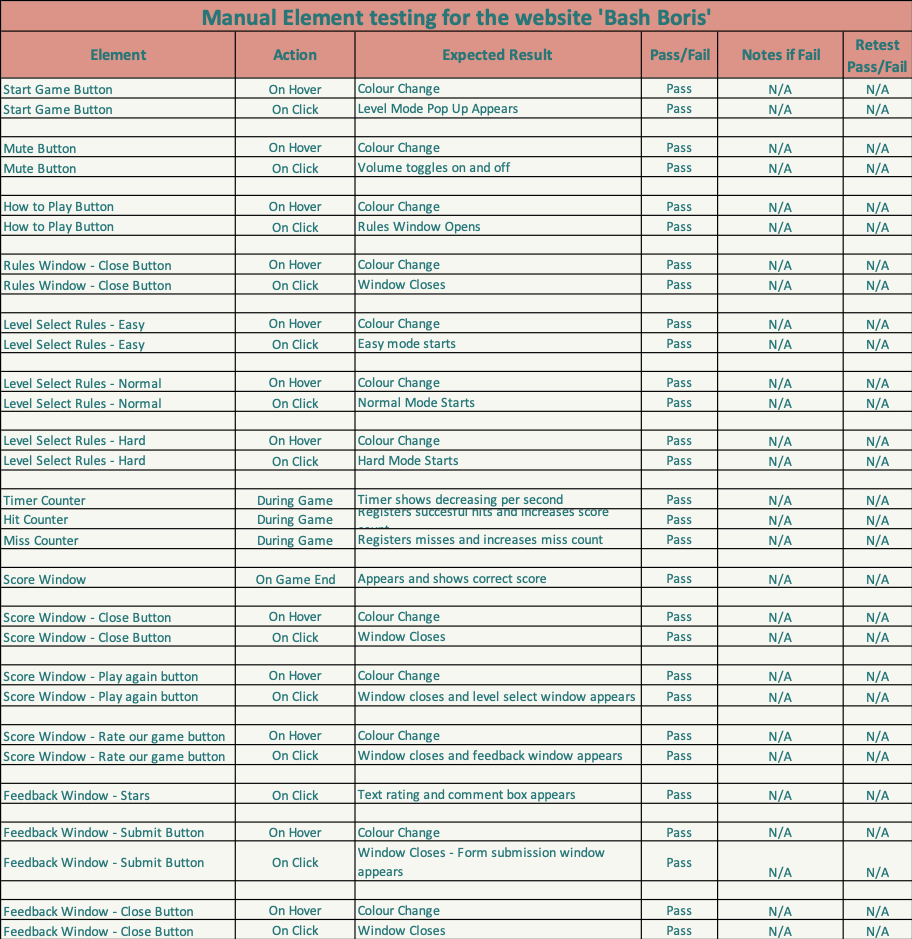

# Testing for the website 'Bash Boris'

The following document outlines all testing carried out on the website 'Bash Boris'

During the construction process, the Dev Tools functionality of Firefox was used to test CSS code initially, where it was then tweaked to the desired outcome.

## Table of Contents

 1. [Validator testing](#validator-testing)
    * [HTML](#html)
    * [CSS](#css)
    * [Lighthouse](#lighthouse-testing)
    * [Javascript](#javascript-testing)
2. [Manual testing](#manual-testing)
    * [Responsive testing](#responsive-testing)
    * [Element testing](#element-testing) 
3. [Known Bugs](#known-bugs)

## Testing

### Validator testing

#### HTML

HTML was tested using the [W3C Markup Validation Service](https://validator.w3.org/)

Five errors were found as detailed in the following screenshot:

 "HTML testing results"

##### Error fixes

1. Errors 1 - 3 were caused by a missing space between attributes. Added space where required.

Retested: ERROR PASSED.

2. Incorrect placement of Main tag. Main tag position was changed to correct place.

Retested: ERROR PASSED.

3. Unclosed Div element in instruction section. This was found and a closing tag added to line 163.

Retested: ERROR PASSED.

The HTML was then rechecked in its entirety. All errors were found to be fixed and no new issues had arisen.

 "HTML retest results"

 

[Back to top](#table-of-contents)

 

#### CSS

CSS was tested using the [W3C CSS Validation Service - Jigsaw](https://jigsaw.w3.org/css-validator/)

One error and twenty three warnings were found as detailed in the following screenshot:

 "CSS testing results"

##### Error and Warning Fixes

1. The single error was casued by the omission of 'seconds' from a transition attribute on the mole image. This was added to correct.

Retested: ERROR PASSED

2. Warnings were given for all button elements that the same colour was used for the background color and border colour of the buttons. This was a deliberate design choice to retain some of the original colour on hover over any button element. As such this did not need retested.

Retested: NOT APPLICABLE

3. Two warnings were received for an unknown vendor extension, namely -webkit. Again this was a deliberate choice of extension and can be ignored.

Retested: NOT APPLICABLE

The CSS was then rechecked and the error had been fixed.

 "CSS retest results"

 

[Back to top](#table-of-contents)

 

#### Lighthouse testing

The website was tested using Google's Lighthouse tool to examine performance and accessibility. The results were as follows: 

 "Lighthouse testing results"

As shown, these results were found to be satisfactory across the board. Whilst the performance rating is lower than the rest at 86, it is still of a high enough value to satisfy the requirements for this game.

 

[Back to top](#table-of-contents)

 

#### Javascript testing

Javascript was tested using [JSHint Validation Tool](https://jshint.com/)

There were 37 warnings generated by JSHint. The vast majority of these were when certain syntax such as 'const', 'let' or 'arrow' syntax was only available to broswers of a certain age.

There were 3 missing semicolons which were subsequently added, and two identified unnecessary semicolons which were removed. 

A warning on line 257 expected an assignment or function call and instead saw an expression. This expression was a repeat of the beginning of the if statement. The offending expression was removed and retested and the error was omitted.

There were also 12 warnings about unused variables. On checking these variables are either assigned later in other functions, or are assigned to a button click through HTML. As such these variables are not actually unused and remain as is.

 

[Back to top](#table-of-contents)

 

## Manual Testing

### Responsive testing

The dev tools facility on Firefox and on Chrome to examine the site on various viewports. These findings were used to decide where the breakpoints for media queries would be. 

As the site was designed to be optimised on desktop, three media queries were created.

The first placed a covering div over all of the viewport for screens less than 567px wide (width of iPhone5) asking that users rotate their screen horizontally. Ideally in future this would be carried out without the need of a div. 

A second media query was added then from 568px wide to 666px wide to and another from 667px wide to 812px wide (iPhone X). Any screen wider than this was deemed to be a desktop screen, and the existing CSS was designed to be truly responsive on these larger screens.

Care had to be taken when designing these media queries to ensure that the mole and mole hole elements remained in line with each other to mainatin the effect of the mole coming out of the hole. Although not ideal on smaller screens, the game remains functional, but as stated in the rules and in the README document it is really best enjoyed on a desktop.

 

[Back to top](#table-of-contents)

 

### Element testing

Every element and link on the site that a user could interact with was manually tested to ensure that the item was behaving as expected. Where necessary, fixes were implemented and documented on the test sheet, as well as via a dedicated commit for each issue.

The below screenshot highlights the result of this testing. The testing spreadsheet (in Excel format) is also [available to download](../testing/manual-testing.xlsx)

 "Manual Link Testing results"

### Known Bugs

On final element testing a bug was discovered whereby if you went to play the game again, all counters would reset, but the game would only play for approximatley one second before the end game pop up would appear.

A hard reload of the page would solve this error, but would not be the best user experience.

In an attempt to solve the bug further instructions were added into the code to reset the timeLeft variable and the timer.textcontent variable.

On retest, when a user would go to play a secind game, this time the game will last for the whole 30 seconds time, but the countdown timer display would run at double time.

Although not ideal, at least a user gets to play the game again for the whole 30 seconds, rather that having to har reload the page to get a full game time amount again. 

At this time the bug remains in the game, but now it does not prevent the user from playing again, which is the best option rather than leaving the original bug as was.