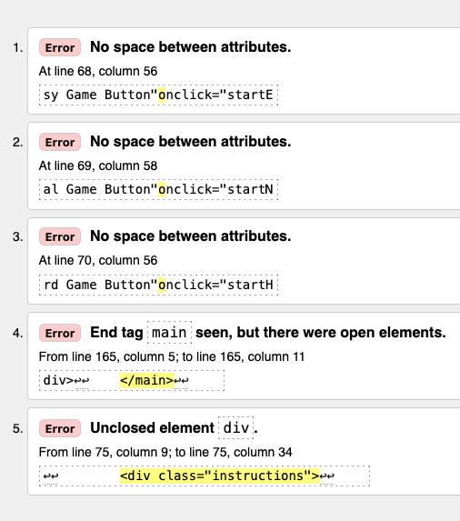
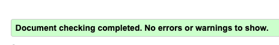
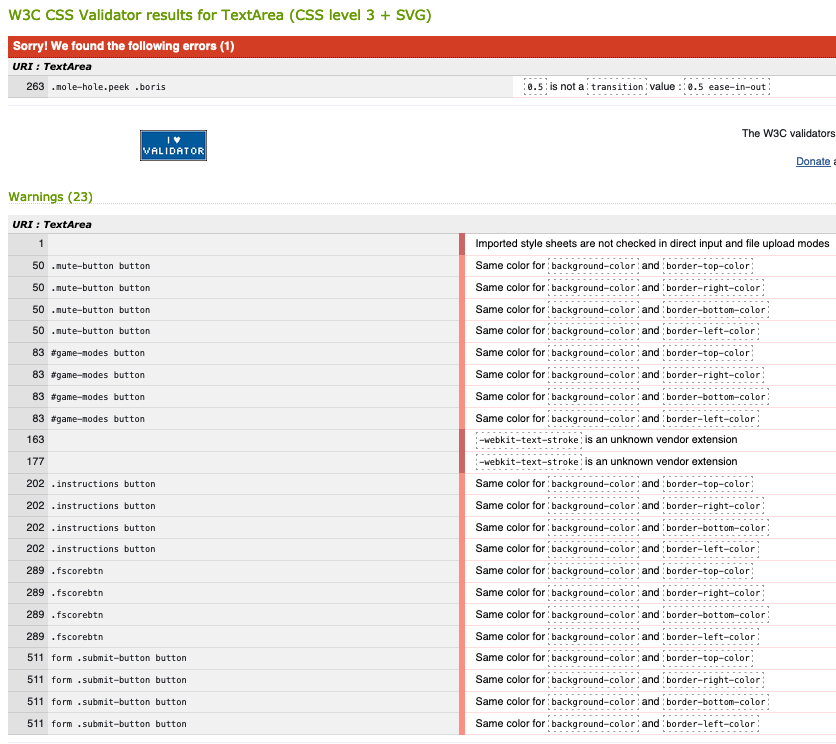
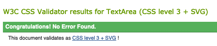
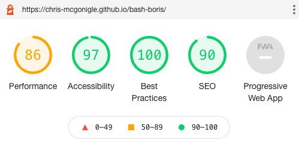

# Testing for the website 'Bash Boris'

The following document outlines all testing carried out on the website 'Bash Boris'

During the construction process, the Dev Tools functionality of Firefox was used to CSS code initially, where it was then tweaked to the desired outcome.

## Automated Testing

### Validator Testing

* HTML

HTML was tested using the [W3C Markup Validation Service](https://validator.w3.org/)

Five errors were found as detailed in the following screenshot:

 "HTML testing results"

#### Error fixes

1. Errors 1 - 3 were caused by a missing space between attributes. Added space where required.

Retested: ERROR PASSED.

2. Incorrect placement of Main tag. Main tag position was changed to correct place.

Retested: ERROR PASSED.

3. Unclosed Div element in instruction section. This was found and a closing tag added to line 163.

Retested: ERROR PASSED.

The HTML was then rechecked in its entirety. All errors were found to be fixed and no new issues had arisen.

 "HTML retest results"

* CSS

CSS was tested using the [W3C CSS Validation Service - Jigsaw](https://jigsaw.w3.org/css-validator/)

One error and twenty three warnings were found as detailed in the following screenshot:

 "CSS testing results"

#### Error and Warning Fixes

1. The single error was casued by the omission of 'seconds' from a transition attribute on the mole image. This was added to correct.

Retested: ERROR PASSED

2. Warnings were given for all button elements that the same colour was used for the background color and border colour of the buttons. This was a deliberate design choice to retain some of the original colour on hover over any button element. As such this did not need retested.

Retested: NOT APPLICABLE

3. Two warnings were received for an unknown vendor extension, namely -webkit. Again this was a deliberate choice of extension and can be ignored.

Retested: NOT APPLICABLE

The CSS was then rechecked and the error had been fixed.

 "CSS retest results"

* Lighthouse testing

The website was tested using Googles Lighthouse tool to examine performance and accessibility. The results were as follows: 

 "Lighthouse testing results"

As shown, these results were found to be satisfactory across the board. Whilst the performance rating is lower than the rest at 86, it is still of a high enough value to satisfy the requirements for this game.

* Javascript testing

Javascript was tested using [JSHint Validation Tool](https://jshint.com/)

There were 37 warnings generated by JSHint. the vast majority of these were when certain syntax suck as const, let or arrow syntax was only avaiable of broswers of a certain age.

There were 3 missing semicolons which were subsequented add, and two identified unnecessary semicolons which were removed. 

A warning on line 257 expected an assignment or funcxtion call and instead saw an expression. This expression was necessary for the mute function to work correctly. A test was ran without this expression but it resulted in the failure of the mute toggle button, so this warning was ignored.

There were also 12 warnings about unused variables. On checking these variables are either assigned later in other functions, or are assigned to a button click through HTML. As such these variables are not actually unused and remain as is.